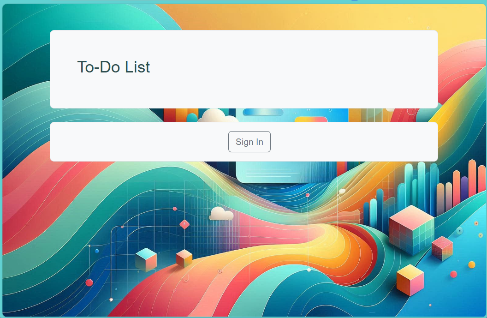
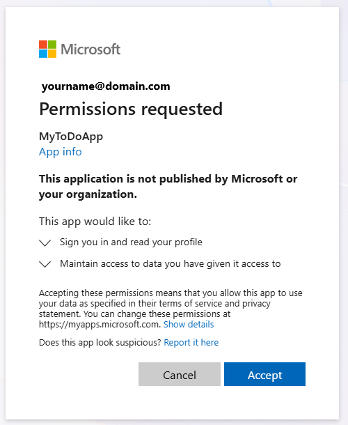
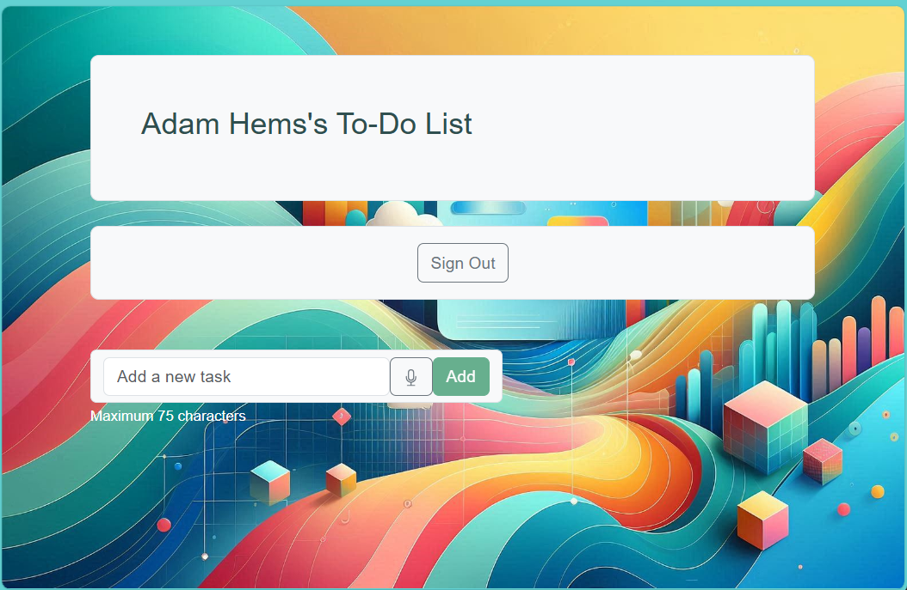
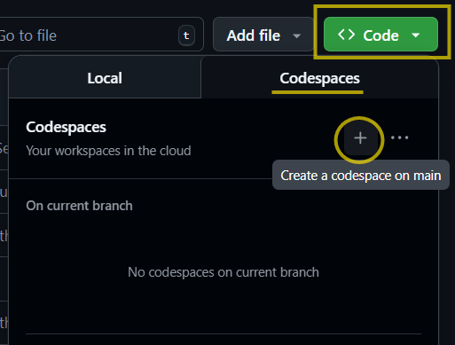

# Azure Sample Application Demo

## Overview

This is a modern, cloud-native sample application that demonstrates enterprise-grade Azure development patterns with AI integration. This sample showcases a complete full-stack application built with Flask (frontend) using Python, Data API Builder (backend API), Azure SQL Database, and Azure AI Foundry, all deployed using Azure Developer CLI (azd) via fully automated Infrastructure as Code (Bicep) and protected throughout with Entra ID.

### Key Features

- **🔐 Zero-Trust Security**: All Azure services use Azure Entra ID (Azure AD) authentication with managed identities for passwordless, secure connections
- **🤖 AI-Powered Recommendations**: Integrated Azure AI Foundry provides intelligent task completion suggestions and priority recommendations
- **🧠 Intelligent Model Selection**: Automated discovery of optimal OpenAI models based on availability and quota in the deployment region at deploy-time, with preference for cost-effective mini/small models
- **📊 Modern API Architecture**: REST and GraphQL endpoints via Microsoft Data API Builder (DAB) for flexible data access, secured using Entra ID
- **🔄 Session Management**: Redis-backed sessions with automatic token refresh and secure credential storage
- **📈 Comprehensive Monitoring**: OpenTelemetry integration with Application Insights for telemetry, logging, and performance tracking
- **🚀 Serverless Deployment**: Runs on Azure Container Apps for automatic scaling and high availability
- **👥 User Data Isolation**: Row-level security ensures users can only access their own tasks

## Usage Demo

### Initial Home Page

This is how the home page looks once it has all been deployed to Azure:



### Loggging in

Once the user clicks the Log In button, they will be prompted for permissions the first time they use the app, like this:



### Logged-In Home Page

Once logged in, the page looks like this, initially:



This brief video shows the application in use once it has all been deployed to Azure and the user has logged in:


[📹 Download full video (MP4)](images/TodoList.mp4)

### Architecture

The application consists of:

- **Frontend Web App**: Flask application with Bootstrap UI, Azure AD authentication, and AI recommendations
- **Backend API**: Data API Builder providing REST/GraphQL endpoints with JWT authentication
- **Database**: Azure SQL Database with Entra ID authentication and row-level security
- **AI Services**: Azure AI Foundry for intelligent task suggestions with managed identity authentication
- **Session Storage**: Azure Cache for Redis with managed identity authentication
- **Monitoring**: Application Insights and Log Analytics workspace with managed identity authentication

### End-to-End Entra ID Authentication

This sample demonstrates a comprehensive zero-trust security model using Azure Entra ID (Azure AD) authentication at every layer:

- **User → Frontend App**: Users authenticate via Azure AD OAuth 2.0 with PKCE flow, receiving JWT tokens for secure session management
- **Frontend App → Backend API**: The web app uses client credentials flow (app-to-app authentication) with Azure AD to obtain access tokens for API calls from Data API Builder
- **Backend API → Database**: Data API Builder uses a user managed identity to authenticate to Azure SQL Database, eliminating connection strings and passwords
- **Frontend App → Azure Services**: The Flask application uses managed identity credentials to authenticate to:
  - **Redis Cache**: Passwordless authentication for session storage
  - **Azure AI Foundry**: Token-based access for AI recommendations
  - **Application Insights**: Secure telemetry publishing
  - **Key Vault**: Retrieving secrets without hardcoded credentials

All authentication flows are configured automatically during deployment, demonstrating enterprise best practices for secure, passwordless cloud applications.

### Deployment with Azure Developer CLI (azd)

This application is designed for one-command deployment using Azure Developer CLI:

1. **Pre-Deployment** (`preup.ps1`): Automatically creates Azure AD app registrations, discovers available OpenAI models with quota, and configures authentication settings
2. **Infrastructure Provisioning** (`azd provision`): Deploys all Azure resources using Bicep templates with intelligent model selection and capacity calculation
3. **Application Deployment** (`azd deploy`): Builds and deploys containerized applications to Azure Container Apps with remote build in Azure Container Registry
4. **Post-Deployment** (`postdeploy.ps1`): Configures redirect URIs and sets runtime environment variables for CORS security

All deployment automation is handled through PowerShell scripts executed by azd lifecycle hooks, making the entire process seamless and repeatable.

## Deployment from Visual Studio Code using Codespaces

The easiest way to get started is to use GitHub Codespaces as all the tools are installed for you. Steps:

1. Clone this repo, then in your repo select "Code", "Codespaces" and click the plus to create a new Codespace: .

   This will launch the repo is VS Code in a Browser.

2. Next, we reccommend you launch the CodeSpace in *Visual Studio Code Dev Containers* as the Login from the command line to Azure using 2-factor Credentials often fails from a CodeSpace running in a Browser. To do this, left-click the name of the Codespace in the bottom-left of the screen and then select "Open in VS Code Desktop" as shown here:

    

   *Note:* If you don't see the name of the CodeSpace in the bottom right, *right*-Click the status bar and ensure 'Remote Host' is checked.

3. Once the project files show up in your desktop deployment of Visual Studio Code (this may take several minutes), use the terminal window to follow the steps below to deploy the infrasructure. To easily view the instructions, select README.md, right-click and select "Open Preview" which will make it easier to read.

### Configure Environment

Use the terminal in Visual Studio Code to do these steps. From the top menu, select "Terminal" and then "New Terminal" in order to create one if one doesn't already appear. Then in this, Terminal, follow these steps:

1. Create a new environment:

   ```shell
   azd env new
   ```

   You will be asked for the name of the environment, which will also be used as the resource group name created by default in eastus2. "rg-" will automatically be prepended to the name so enter something like "adamhems-todoapp" for example.

2. (Optional) Set Environment Variables:

   There are a number of local variables you can optionally set depending on your preferences. The first of these is the TENANT_ID of your Azure environment, if you have a specific one you wish to use; in which case enter it like so:

   ```shell
   azd env set TENANT_ID <your tenant ID>
   ```

   Another is AZURE_SUBSCRIPTION_ID, which you can set in the same way as above if you wish to use a particular Azure Subscription. Otherwise you'll be given the option of selecting one in the next step.

   ```shell
   azd env set AZURE_SUBSCRIPTION_ID <your Subscription ID>
   ```

   Lastly you can also set AZURE_LOCATION which is the Azure region you want everything deployed it, which uses 'eastus2' as the default if this value is not set.

   ```shell
   azd env set AZURE_LOCATION westus
   ```

3. Provision Infrastructure

   This is initiated with one command like so:

   ```shell
   azd up
   ```

   You will be prompted to login to Azure the first time you run this command; select "Y" in order to so so. A web browser will pop up and you will select the account you wish to use. Please note if this fails, make sure you have followed Step at the top of the page to launch the CodeSpace in *Visual Studio Code Dev Containers*.

   You may be asked to log in a second time using <https://microsoft.com/devicelogin> and entering a code (provided). Do so, if asked. You may also be asked "Are you trying to sign in to Microsoft Azure PowerShell?" - select Yes if so in order to run the automated scripts of this deployment.

4. De-Provision Infrastructure

   To remove everything created in the step above, run one command like so:

   ```shell
   azd down --force --purge
   ```

## Project Documentation

This repository contains detailed documentation for each component of the MyToDoApp application:

- **[App Documentation](app/README.md)** - Frontend web application built with Flask, including authentication flow, AI-powered recommendations, session management, and integration with Azure services using managed identity
- **[API Documentation](api/README.md)** - Backend API service using Microsoft Data API Builder (DAB), providing REST and GraphQL endpoints with Azure AD authentication and managed identity database access
- **[Infrastructure Documentation](infra/README.md)** - Infrastructure as Code (IaC) using Azure Bicep templates, including architecture overview, module descriptions, and deployment configuration for all Azure resources
- **[Scripts Documentation](scripts/README.md)** - PowerShell automation scripts for the Azure Developer CLI (azd) deployment lifecycle, including pre-deployment setup, post-provisioning configuration, and teardown procedures
